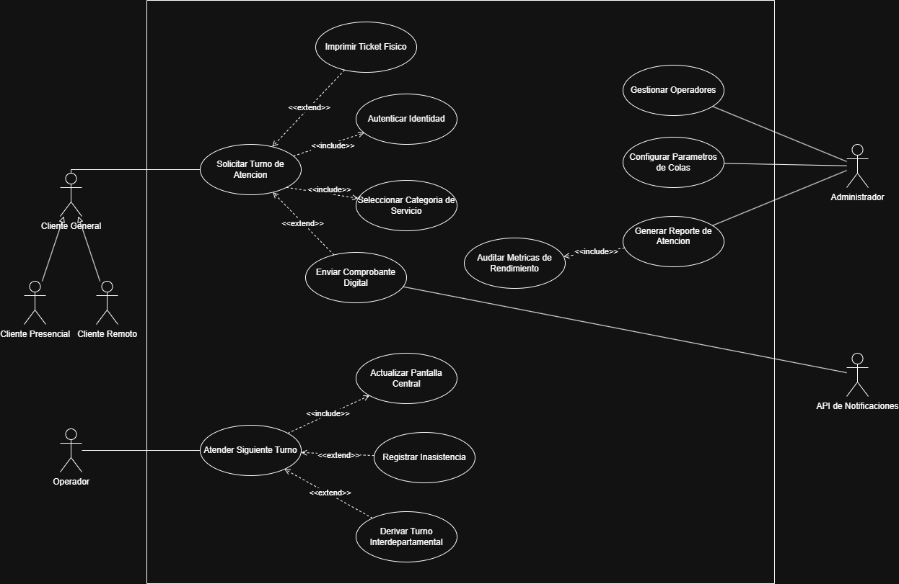
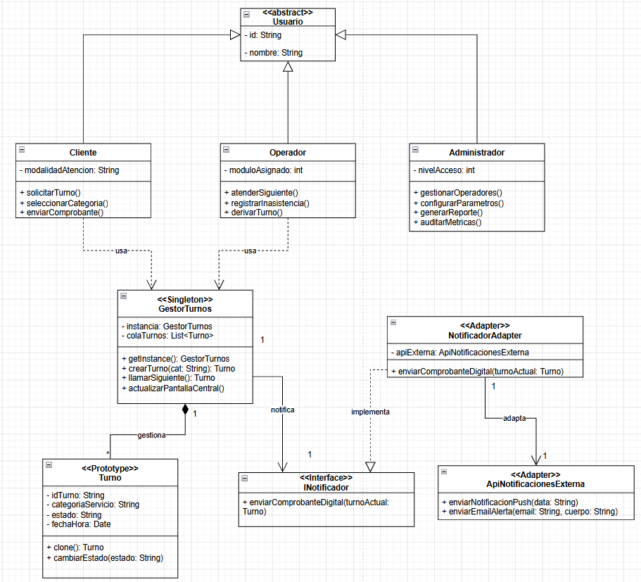

# 🎫 Sistema de Gestión de Turnos Digitales - Tunomatico

## ✅ Descripcion Genereral del sistema

Este proyecto corresponde al modelado arquitectónico completo de un "Sistema de Gestión de Turnos Digitales (Tunomático)", orientado a optimizar y digitalizar el proceso de atención al cliente en sucursales con alto flujo de público, eliminando las filas físicas y reemplazándolas por una cola virtual inteligente, accesible tanto de forma presencial como remota.

El sistema considera los aspectos operacionales críticos de un entorno de atención multicanal, incluyendo:

El sistema considera los aspectos operacionales críticos de un entorno de atención multicanal, incluyendo:

- Solicitud y emisión de turnos desde tótems físicos o dispositivos remotos vía web.
- Gestión centralizada de la cola de atención con llamado secuencial por operador.
- Visualización en tiempo real del estado de la cola en pantallas centrales de la sucursal.
- Envío de comprobantes digitales e impresión de tickets físicos según el canal del cliente.
- Configuración flexible de categorías de servicio y parámetros de atención por administrador.
- Integración con proveedores externos de notificaciones vía API.
- Generación de reportes y auditoría de métricas de rendimiento operacional.

---

## 🔍 Objetivos del Modelado

- Desarrollar una transición completa desde la visión funcional hasta el despliegue físico del sistema.
- Aplicar patrones de diseño reconocidos en el diseño lógico y reflejar su materialización en la arquitectura de implementación.
- Ejercitar el pensamiento arquitectónico en la separación de responsabilidades, modularidad y escalabilidad del sistema.

---

## 🔹 1. Diagrama de Casos de Uso UML

### Descripción General

El análisis funcional del sistema Tunomático permitió identificar con precisión los actores involucrados y las funcionalidades críticas del flujo de atención. Se aplicaron correctamente las relaciones `<<include>>` y `<<extend>>` para reflejar de manera fiel los flujos obligatorios y los comportamientos condicionales del proceso.

---

### Actores Identificados

| Actor | Tipo | Descripción |
|---|---|---|
| **Cliente General** | Primario (abstracto) | Actor base que generaliza hacia Cliente Presencial y Cliente Remoto. Evita duplicar casos de uso idénticos para ambos subtipos. |
| **Cliente Presencial** | Primario | Especialización del Cliente General que interactúa mediante el tótem físico de la sucursal. |
| **Cliente Remoto** | Primario | Especialización del Cliente General que accede al sistema mediante un navegador web. |
| **Operador** | Primario | Responsable de la atención en ventanilla. Gestiona el llamado de turnos y los eventos derivados de la atención. |
| **Administrador** | Primario | Gestiona la configuración del sistema, los operadores asignados y la supervisión mediante reportes y métricas. |
| **API de Notificaciones** | Externo (sistema) | Actor externo de tipo sistema que recibe eventos del sistema para el despacho de comprobantes digitales. |

La relación de **generalización** entre `Cliente General` y sus subtipos `Cliente Presencial` y `Cliente Remoto` está técnicamente justificada: ambos subtipos comparten el comportamiento de solicitar un turno, pero difieren en el canal de acceso y en los flujos opcionales disponibles (impresión física vs. comprobante digital). Este modelado evita la duplicación de lógica funcional y refleja correctamente la herencia de comportamiento.

---

### Casos de Uso Principales y Relaciones Aplicadas

#### Relaciones `<<include>>`

Las relaciones `<<include>>` se utilizaron en todos aquellos flujos donde el caso de uso base **no puede ejecutarse sin** el caso de uso incluido, es decir, se trata de comportamientos obligatorios e inseparables.

- **Solicitar Turno de Atención → Autenticar Identidad**
  Toda solicitud de turno requiere obligatoriamente verificar la identidad del cliente antes de continuar. No existe el flujo principal sin esta validación previa, lo que justifica técnicamente el uso de `<<include>>` y descarta el uso de `<<extend>>`.

- **Solicitar Turno de Atención → Seleccionar Categoría de Servicio**
  No es posible asignar un turno sin conocer el área de atención a la que va dirigido. Esta selección siempre ocurre como parte del flujo principal, siendo un comportamiento inherente e ineludible.

- **Atender Siguiente Turno → Actualizar Pantalla Central**
  Cada vez que un operador llama al siguiente turno, la pantalla central de la sucursal debe actualizarse de forma automática e inmediata. Se trata de un comportamiento obligatorio e inseparable del flujo principal de atención.

- **Auditar Métricas de Rendimiento → Generar Reporte de Atención**
  Para generar cualquier reporte de atención es necesario primero auditar las métricas disponibles del sistema. El reporte no existe sin esa consulta previa, lo que hace que la relación sea obligatoria.

#### Relaciones `<<extend>>`

Las relaciones `<<extend>>` se emplearon para representar comportamientos **opcionales o condicionados** que extienden el flujo principal solo bajo circunstancias específicas.

- **Imprimir Ticket Físico → Solicitar Turno de Atención**
  Solo aplica para clientes presenciales que requieren el comprobante en papel. Es un flujo opcional y condicional al canal de acceso del cliente, lo que justifica el uso de `<<extend>>`.

- **Enviar Comprobante Digital → Solicitar Turno de Atención**
  Ocurre únicamente si el cliente tiene habilitadas las notificaciones digitales en su perfil o configuración. Al no ser un comportamiento universal, se modela correctamente como extensión.

- **Registrar Inasistencia → Atender Siguiente Turno**
  Si el cliente no se presenta cuando es llamado, el operador puede registrar la inasistencia. Se trata de un flujo alternativo y excepcional al proceso estándar de atención.

- **Derivar Turno Interdepartamental → Atender Siguiente Turno**
  Cuando el operador determina que el cliente debe ser atendido por un departamento distinto, puede derivar el turno activo. Ocurre solo bajo una condición específica detectada durante la atención.

---

## 🔹 2. Diagrama de Clases UML con Patrones Aplicados

### 🧩 Justificación Arquitectónica y Patrones Aplicados

La selección de los patrones de diseño no fue arbitraria, sino el resultado de un análisis técnico orientado a resolver problemas concretos de acoplamiento, manejo de estado en memoria y extensibilidad futura del sistema. A continuación se presenta la justificación profunda de cada patrón aplicado.

---

#### 1. `<<Singleton>>` — Clase `GestorTurnos`

**El problema identificado:**
El corazón del sistema Tunomático es la cola de turnos en memoria. Todos los actores del sistema — clientes en los tótems presenciales, clientes remotos vía web y operadores en las ventanillas — deben interactuar siempre con **exactamente la misma lista de turnos**. Si se permitiera instanciar el gestor mediante constructores clásicos (`new GestorTurnos()`), el sistema correría el riesgo de generar múltiples colas independientes en memoria, lo que rompería la lógica de atención secuencial y produciría duplicidad de tickets.

**La solución aplicada:**
Al implementar el patrón Singleton, se ocultó el constructor (`- GestorTurnos()`) y se expuso el método estático `+ getInstance(): GestorTurnos`. Esto garantiza que el sistema mantenga un único punto de verdad centralizado para la variable `colaTurnos`. Sin importar cuántos operadores invoquen simultáneamente al método `llamarSiguiente()`, todos estarán consumiendo y modificando la misma instancia en memoria.

**Intención arquitectónica:**
- Centralizar el control de la cola de atención como recurso compartido del sistema.
- Evitar condiciones de carrera y duplicidad de tickets en escenarios de concurrencia.
- Facilitar la escalabilidad futura permitiendo la consulta distribuida desde múltiples nodos cliente.

---

#### 2. `<<Prototype>>` — Clase `Turno`

**El problema identificado:**
La creación de un ticket de atención (`Turno`) requiere establecer varios valores base predefinidos — como el estado inicial o el formato de la categoría de servicio — antes de asignarle un identificador único y una estampa de tiempo precisa. Construir este objeto desde cero cada vez que un cliente presiona el botón en el tótem resultaba en un proceso repetitivo y poco flexible ante la adición futura de atributos al modelo del ticket.

**La solución aplicada:**
Se implementó el patrón Prototype dotando a la clase `Turno` del método `+ clone(): Turno`. En lugar de construir el objeto atributo por atributo en cada operación, el sistema utiliza un turno preconfigurado como molde base y simplemente clona esa instancia, alterando únicamente los datos variables: la `fechaHora` exacta de emisión y el `idTurno` único. Esto hace que la instanciación sea más limpia, eficiente y mantenible.

**Intención arquitectónica:**
- Reducir la complejidad y el tiempo de creación de objetos en operaciones de alta frecuencia.
- Permitir la parametrización de turnos especiales por tipo de campaña o protocolo de atención.
- Facilitar la extensión del modelo sin modificar la lógica de instanciación centralizada.

---

#### 3. `<<Adapter>>` — Clases `NotificadorAdapter` e `INotificador`

**El problema identificado:**
Según el caso de uso *Enviar Comprobante Digital*, el sistema debe interactuar con un actor externo (`API de Notificaciones`). Como principio de buena arquitectura, no es viable acoplar directamente la lógica de negocio central (`GestorTurnos`) a los métodos específicos de una API de terceros (`ApiNotificacionesExterna`). Si el proveedor de notificaciones modifica su interfaz en el futuro — por ejemplo, renombrando `enviarEmailAlerta()` — ese cambio propagaría errores hacia el núcleo del dominio.

**La solución aplicada:**
Se implementó el patrón Adapter en dos niveles. Primero, se definió la interfaz `<<Interface>> INotificador` con el método estándar `+ enviarComprobanteDigital(turnoActual: Turno)`, que representa el contrato que el sistema interno entiende. Luego, se construyó la clase `NotificadorAdapter` que implementa dicha interfaz y traduce la petición hacia los métodos específicos requeridos por la `ApiNotificacionesExterna` (`enviarNotificacionPush()`, `enviarEmailAlerta()`). Si el día de mañana se cambia de proveedor, solo es necesario escribir un nuevo adaptador sin modificar una sola línea del código del gestor.

**Intención arquitectónica:**
- Asegurar la independencia tecnológica del dominio respecto a integraciones externas.
- Facilitar el mantenimiento y evolución del módulo de notificaciones de forma aislada.
- Permitir la sustitución o adición de proveedores externos sin impacto en el núcleo del sistema.

---
